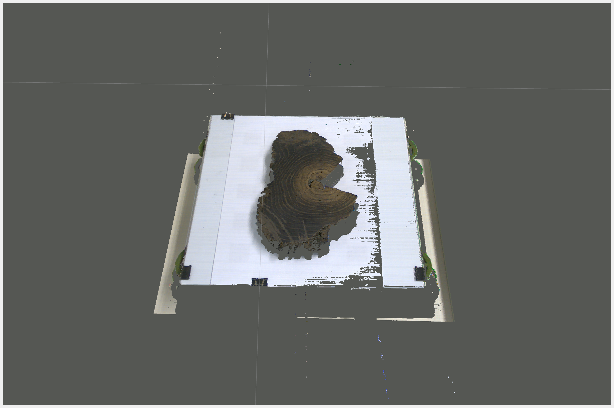
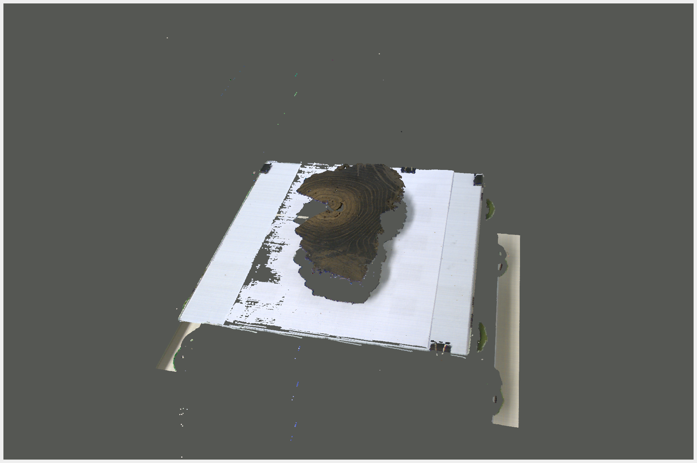
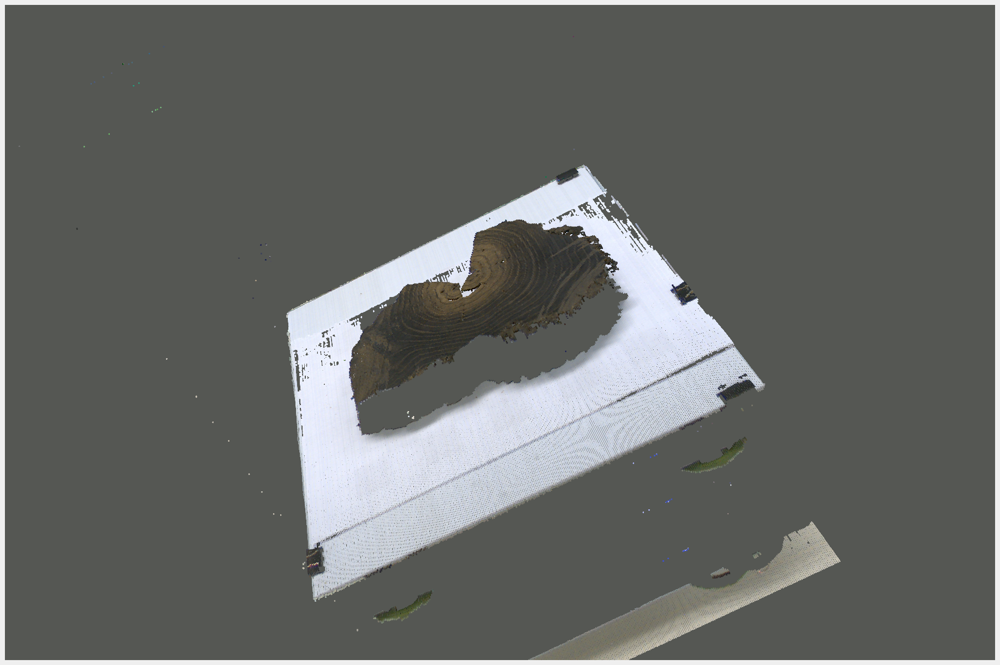
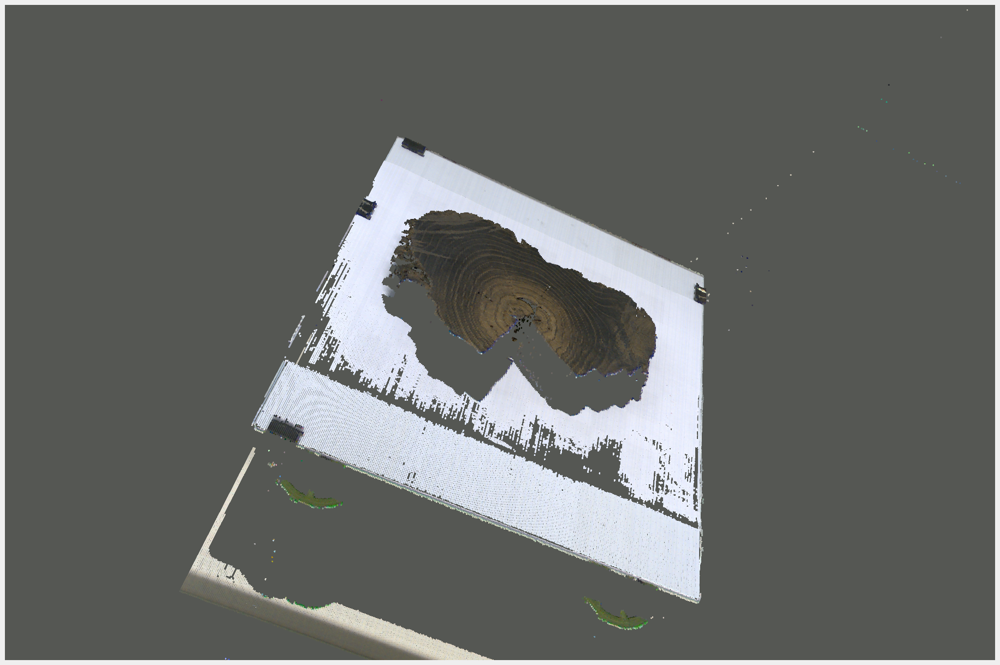

# A lasertriangulation  sensor with ROS2

**Author:** Tristan Elias Wolfram

This Repository introduces the sofware packages for a laser triangulation sensor. Thhes sensor is used to rekonstruct surfaces of wood slices.  

