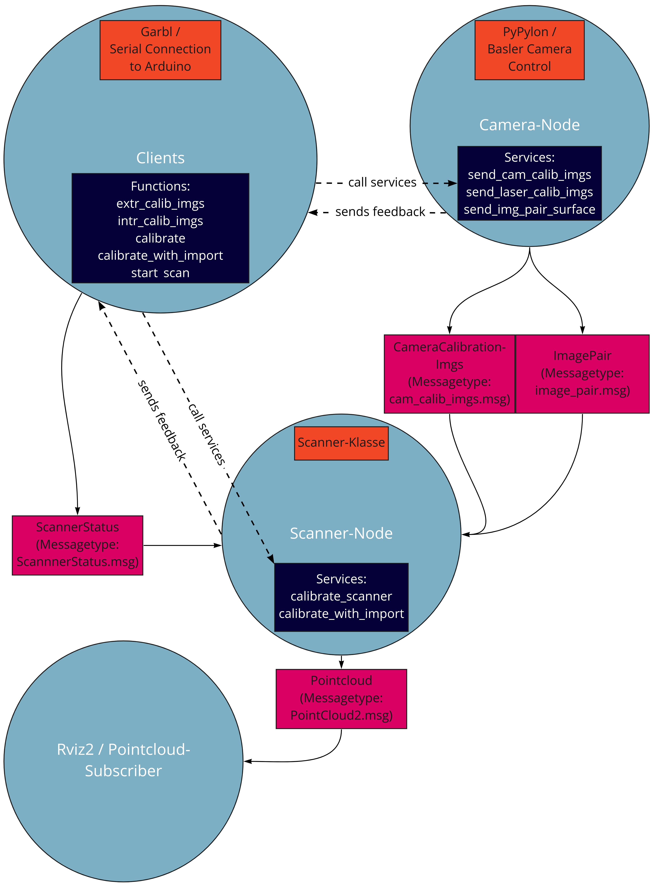
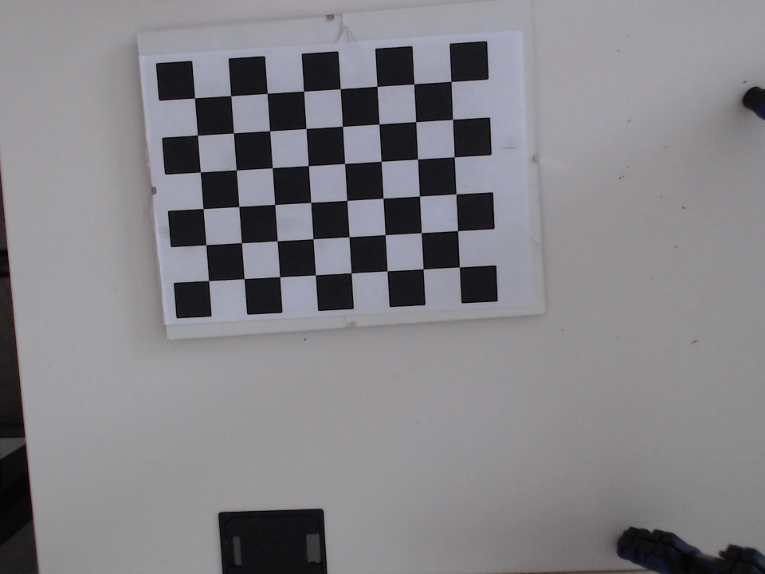
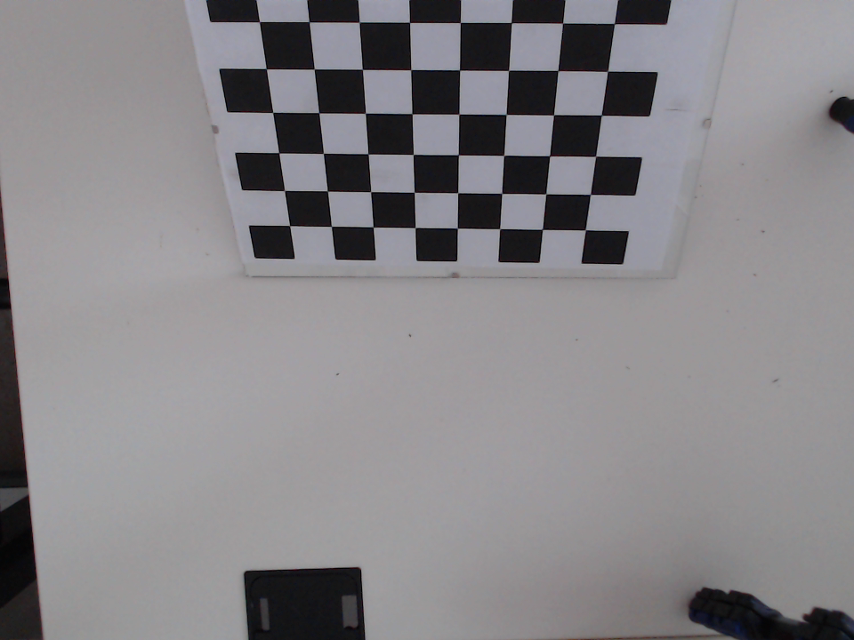
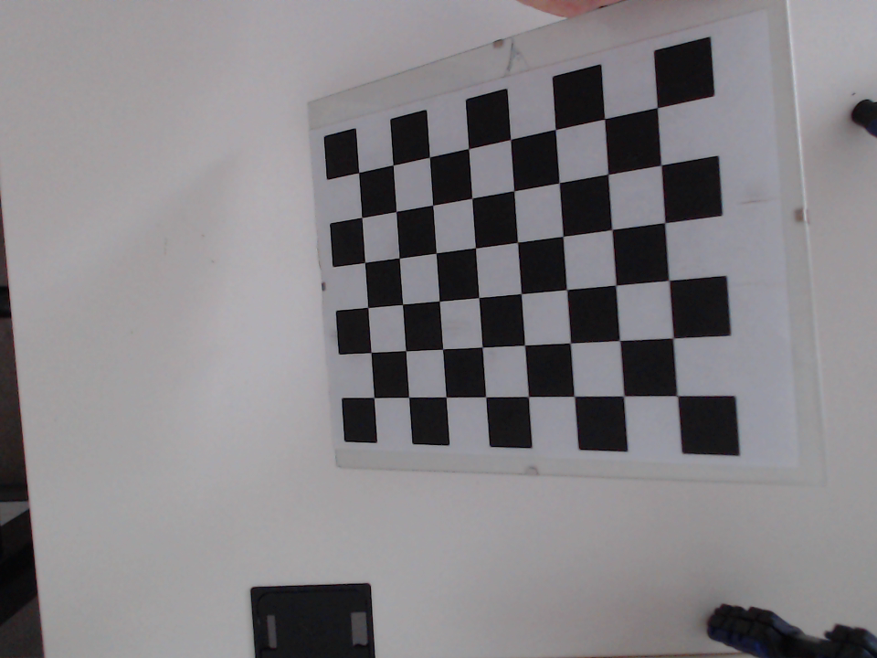
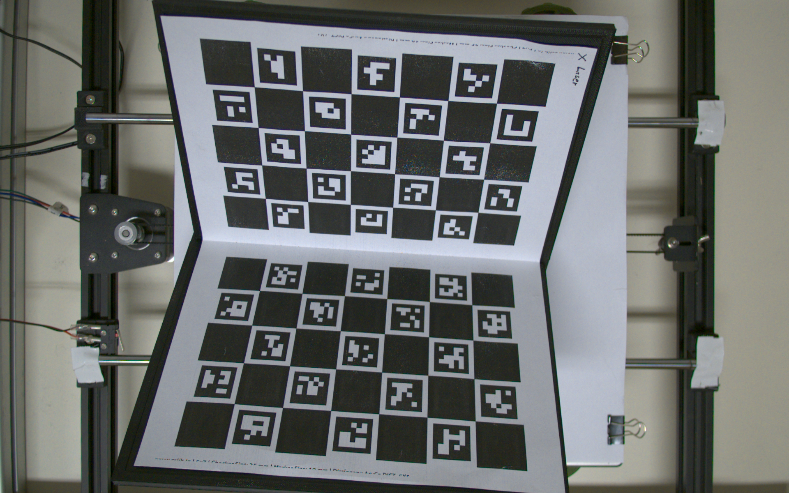
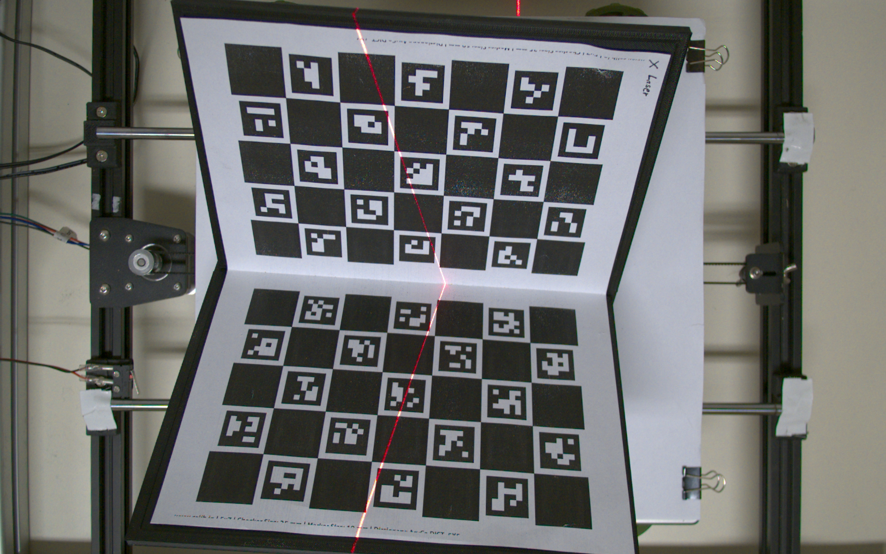

# A laser triangulation  sensor with ROS2


___

**Author:** Tristan Elias Wolfram

This Repository introduces a sofware package for a laser triangulation sensor. The sensor is used to reconstruct surfaces of wood slices.  

Here some [example scans](scans) produced by the sensor:
<p float="left">


</p>

📖 The scanner was developed as part of a Bachelor's thesis at the ___Institut für Technik und Informatik (ITI)___ at ___University of Applied Sciences Mittelhessen___ in Germany. You can find the thesis [here](thesis).

# The surface_scanner package

## 	⚙️ Requirements
* The system ist tested under Ubuntu 20.04 LTS (Focal Fossa).
* A Basler a2A1920-160ucPRO is used as camera (*with the current code it should be possible to use any other Basler camera*).
* The used ROS version is [**ROS2 Galactic**](https://docs.ros.org/en/galactic/index.html).
* Used Python packages are:
  * [Numpy](https://numpy.org/),
  * [OpenCv](https://opencv.org/),
  * [Open3D](http://www.open3d.org/),
  
The Sytem is tested with two setups.
* Test setup with Basler camera:
    * A Basler a2A1920-160ucPRO is used as camera (*with the current code it should be possible to use any other Basler camera*).
    * [Pypylon](https://github.com/basler/pypylon) (driver for Basler cameras).
    * Arduino with CNC-Shield to use GRBL,
    * linear slide from a 3D-printer,
    * Python libary [serial](https://pyserial.readthedocs.io/en/latest/shortintro.html).
* Setup with Raspberry Pi:
    * tested on **Raspberry Pi 3B Plus** and **Raspberry Pi 4**
    * MIPI camera module

## Installation

Go to your **ROS workspace** in the **src**-directory and clone the repository.
```
git clone https://github.com/TristanWolfram/ros2_surface_scanner.git
```
Use **colcon** to build the package:
```
cd ..
colcon build
```
To use the ROS2-nodes you have to source your current worspace from inside the workspace directory:
```
. install/setup.bash
```

## Usage
### Start the Scanner
To launch the whole surface scanner use the launch-file:
```
ros2 launch surface_scanner surface_scanner.launch.py
```
This will start three nodes, the **surface_scanner_node**, **camera_node** and **rviz2**.

```
# for raspberry setup
ros2 launch surface_scanner surface_scanner_rasp.launch.py
```

## Nodes
### surface_scanner_node
Responsible for all calculations. Stores all data.
#### Subscribed Topics
* **`/cam_calib_imgs`** ([interfaces/msg/CameraCalibrationImgs](interfaces/msg/CameraCalibrationImgs.msg))

    List of 10 images for intrinsic calibration.
* **`/img_pair`** ([interfaces/msg/ImagePair](interfaces/msg/ImagePair.msg))

    Two images for extrinsic calibration or to reconstruct surface line.
#### Published Topics
* **`/surface_line`** ([sensor_msgs/PointCloud2](http://docs.ros.org/en/api/sensor_msgs/html/msg/PointCloud2.html))

    The resulting pointcloud.
#### Services
* **`calibrate_scanner`** ([std_srvs/Trigger](http://docs.ros.org/en/api/std_srvs/html/srv/Trigger.html))

    Calibrates the scanner. Only usable if the scanner has recieved the calibration (intrinsic and extrinsic) images. Calibration result can be checked via Rviz2.
* **`calibrate_with_import`** ([interfaces/srv/CalibrateLaserImport](interfaces/srv/CalibrateLaserImport.srv))

    Calibrates the scanner by importing the camera data. Only usable if the scanner has recieved the extrinsic calibration images. Path to the intrisic camera data as **.npz**-file is required. Calibration result can be checked via Rviz2.

### camera_node (camera_node_rasp)
The optical sensor of the triangolation sensor. Takes images for calibration and to reconstruct the surface. The pictures will be send to the surface_scanner_node via special topics.
#### Published Topics
* **`/cam_calib_imgs`** ([interfaces/msg/CameraCalibrationImgs](interfaces/msg/CameraCalibrationImgs.msg))

    Images for intrinsic calibration.
* **`/img_pair`** ([interfaces/msg/ImagePair](interfaces/msg/ImagePair.msg))

    Two images for extrinsic calibration or to reconstruct surface line.
* **`/img_publisher`** ([sensor_msgs/Image](https://docs.ros.org/en/api/sensor_msgs/html/msg/Image.html))

    Images for the image stream
#### Services
* **`send_cam_calib_imgs`** ([std_srvs/Trigger](http://docs.ros.org/en/api/std_srvs/html/srv/Trigger.html))

    Used to take 10 images for intrinsic camera calibration. The image list will be published via **/CameraCalibrationImgs**-Topic.
* **`send_img_pair_calib`** ([std_srvs/Trigger](http://docs.ros.org/en/api/std_srvs/html/srv/Trigger.html))

    Used to take an image pair of the special calibration board. The image pair will be published via **/ImagePair**-Topic.

* **`send_img_pair_surface`** ([std_srvs/Trigger](http://docs.ros.org/en/api/std_srvs/html/srv/Trigger.html))

    Used to take an image pair of the surface. The image pair will be published via **/ImagePair**-Topic.

* **`start_img_stream`** ([std_srvs/Trigger](http://docs.ros.org/en/api/std_srvs/html/srv/Trigger.html))

    Used to start the camera stream.

* **`stop_img_stream`** ([std_srvs/Trigger](http://docs.ros.org/en/api/std_srvs/html/srv/Trigger.html))

    Used to stop the camera stream.

### rviz2
Used as point cloud subscriber
#### Subscribed Topics
* **`/surface_line`** ([sensor_msgs/PointCloud2](http://docs.ros.org/en/api/sensor_msgs/html/msg/PointCloud2.html))

    Rviz2 shows the resulting pointcloud. Here you can review the results 
    of the ongoing scan.

* **`/laser_plane`** ([sensor_msgs/PointCloud2](http://docs.ros.org/en/api/sensor_msgs/html/msg/PointCloud2.html))

    This topic show the calculated laser plane and the laser lines used to calibrate it. Here you can check if the calibration was successful.

* **`/img_publisher`** ([sensor_msgs/Image](https://docs.ros.org/en/api/sensor_msgs/html/msg/Image.html))

    Rviz2 can also show the published images from the image stream.

<!--## Overview

-->
---
## Calibration

>The following functions will start a client that calls a defined service.

Now you have to calibrate the scanner. The calibration consists of an **intrinsic** and an **extrinsic** calibration. For the intrinsic calibration, a chessboard must be recorded from 10 different positions. For the extrinsic one, the special calibration board with ChArUco markers must be placed under the sensor. 

```
ros2 run surface_scanner intr_calib_imgs
```

This function is used to take the intrinsic calibration images.
>However, the functionality for manually capturing 10 different images is not yet implemented.

Therefore you have to take the 10 images with your camera by yourself. You have to put these 10 images in the following Directory: [surface_scanner/input/](surface_scanner/input). Additionally the images must be named **calibration_img_<0-9>.png**.

*If .png is the wrong file type for you, you have to change it manually in the code. You can find the code segment in the **Camera_Node** at function **send_cam_calib_imgs**.*

The images shoud be look like this:
<p float="left">



</p>

```
ros2 run surface_scanner extr_calib_imgs
```

This function is used to take the extrinsic calibration images. You have to take an clear picture of the calibration board. The image pair shoud look like this:
<p float="left">


</p>


Now it is possible to calibrate the whole scanner by typing the following function into your terminal:
```
ros2 run surface_scanner calibrate
```
If the calibration succeded you will find the results in the [out](surface_scanner/out)-directory. The Scanner_Node will also send a point cloud of the calculated laser plane to rviz2. The used topic for that is *laser_plane*.

For the intrinsic calibration an .npz-file should be created. You can use this file to import the camera data when you start the scanner another time. So you don't have to do an intrinsisc calibration again. Just use this calibration method:
```
ros2 run surface_scanner calibrate_with_import <path to camera parameters>
```

## Camera Stream
You can turn on an camera stream. The camera node will now continuously publish images with the given topic (*img_publisher*). Rviz2 can subscribe to this topic an shows the images.

You can use this image stream to focus the camera or to put the calibration board or chessboard in the right position.
```
ros2 run surface_scanner start_img_stream

ros2 run surface_scanner stop_img_stream
```

## Pointcloud generation
When the scanner is calibrated you can use it to reconstruct surfaces. A method that is always possible after calibration is to acquire one surface line with the following function. You will find the created pointcloud in the out-directory.
```
ros2 run surface_scanner surface_line
```
This function generates several surface_line pointclouds in a row.
```
ros2 run surface_scanner start_scan
```